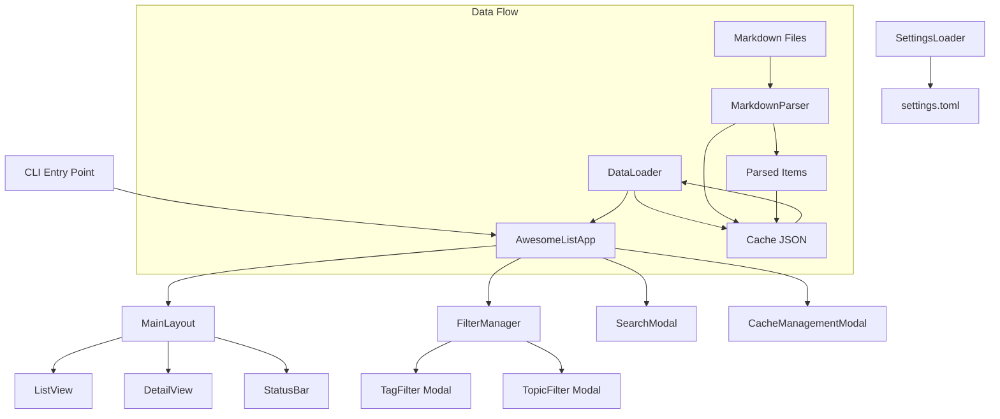
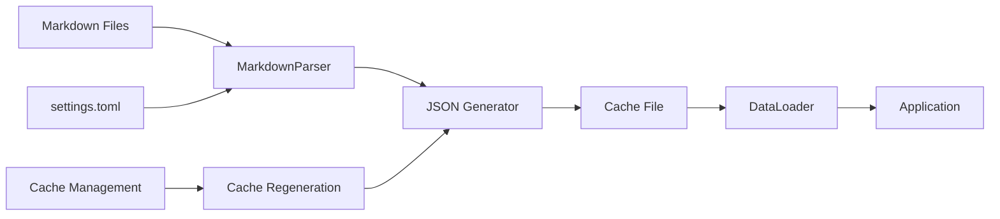
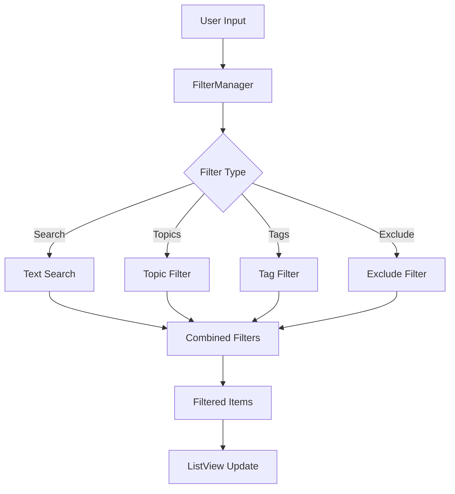

# Development Guidelines

For basic project information and usage instructions, see @README.md.

## Development Setup

Install development dependencies:

```bash
git clone <repository-url>
cd awesome-list-view
uv sync --dev
```

## Development Commands

This project uses `just` as the task runner. Available commands:

```bash
just fmt        # Format code with ruff
just lint       # Lint code with ruff, ty, and typos
just test       # Run tests with pytest
just run        # Run the app
just install    # Install dependencies
```

**Always** run `just fmt lint test` before committing changes.

## Architecture Overview



The app is built with Python's `textual` library providing a terminal user interface.

## Codebase Structure

```text
app/
├── app/                          # UI Components
│   ├── layout.py                 # Main layout manager
│   ├── list_view.py              # Item list display
│   ├── detail_view.py            # Item detail display
│   ├── tag_filter.py             # Tag filter modal
│   ├── topic_filter.py           # Topic filter modal
│   ├── search_modal.py           # Search input modal
│   ├── cache_management.py       # Cache management modal
│   └── data_loader.py            # Data loading utilities
├── funcs/                        # Core Logic
│   ├── filter_manager.py         # Filtering logic and state
│   ├── markdown_parser.py        # Markdown file parsing
│   ├── settings_loader.py        # Configuration loading
│   ├── cache_manager.py          # Cache management
│   ├── editor_manager.py         # External editor integration
│   ├── url_manager.py            # URL opening utilities
│   ├── tag_processor.py          # Tag processing and inheritance
│   ├── json_generator.py         # JSON cache generation
│   ├── schema.py                 # Data structure definitions
│   └── exceptions.py             # Custom exceptions
└── cli.py                        # Application entry point
```

## Configuration System

### Settings File Format

The application uses XDG-compliant configuration. Settings lookup order:

- `$XDG_CONFIG_HOME/awesome-list-view/settings.toml`
- `~/.config/awesome-list-view/settings.toml`

Required format:

```toml
# Required: List of markdown files to parse
AWESOME_LIST_PATHS = [
  "/path/to/awesome-list-1.md",
  "/path/to/awesome-list-2.md",
]

# Optional: Tags to exclude from curation (defaults to empty list)
EXCLUDE_TAGS = ["deprecated", "legacy", "experimental"]
```

### Custom Configuration Path

Use `--config` CLI argument to specify a custom configuration file:

```bash
uv run python -m app --config /custom/path/settings.toml
```

### Exclude Tags Feature

Items with excluded tags are filtered out at the data loading level:

- Respects tag inheritance from headings and frontmatter
- Completely removes items from all views and counts
- Updated dynamically via `FilterManager.set_exclude_tags()`

API methods:

- `get_exclude_tags() -> list[str]`: Get current exclude tags
- `get_total_items_count() -> int`: Get count before exclusion
- `get_excluded_items_count() -> int`: Get count of excluded items

## Cache System



The application builds a JSON cache from markdown files:

- **Location**: `~/.cache/awesome-list-view/awesome_list.json` (XDG compliant)
- **Auto-update**: Cache regenerated when source files change
- **Manual control**: `--regenerate-cache` CLI flag or `r` key in app
- **Structure**: Array of topics with nested items containing title, tags, link, description

Cache structure:

```json
[
  {
    "topic": "Topic Name",
    "items": [
      {
        "title": "Item Title",
        "tags": ["tag1", "tag2"],
        "link": "https://example.com",
        "description": "Item description"
      }
    ]
  }
]
```

## Markdown Format Specification

### Document Structure

1. **Frontmatter** (optional): YAML with `tags` array
2. **Topic**: Single level-1 heading (`#`) defines the topic
3. **Sections**: Level-2 (`##`) and level-3 (`###`) headings for organization
4. **Items**: Bullet points with title, URL, and optional description

### Tag Inheritance

Tags are inherited in this priority order:

1. Inline item tags (`#tag`)
2. Ancestor heading tags (`## Section #tag`)
3. Frontmatter tags (`tags: [tag1, tag2]`)

The `awesome` tag is automatically excluded as non-meaningful.

### Item Format

```markdown
- Item Title #tag1 #tag2
  <https://example.com>

  Optional multi-line description
  can span multiple paragraphs.
```

Required elements:

- First line: item title (with optional inline tags)
- First URL: item link
- Remaining content: description (optional)

## Filtering System



### Filter Pipeline

Filters are applied in this order:

1. **Exclude tags**: Remove items with excluded tags (permanent)
2. **Search**: Text matching over title/description/tags
3. **Topics**: Filter by selected topics (OR logic)
4. **Tags**: Filter by selected tags (AND/OR modes)

### Components

- **FilterManager** (`filter_manager.py`): Core filtering logic and state
- **TagFilter** (`tag_filter.py`): Modal for tag selection with AND/OR modes
- **TopicFilter** (`topic_filter.py`): Modal for topic selection with OR logic
- **SearchModal** (`search_modal.py`): Modal for text search input

### Topic vs Tag Filtering

**Topics** (mutually exclusive):

- Extracted from level-1 headings
- Each item belongs to exactly one topic
- OR logic for multiple selections
- Key binding: `t`

**Tags** (multiple per item):

- From inline tags, headings, and frontmatter
- Items can have many tags
- AND/OR modes available
- Key bindings: `f` or `Space`

### FilterManager API

Core methods:

```python
# Topic filtering
get_topic_counts() -> dict[str, int]
toggle_topic_filter(topic: str)
get_selected_topics() -> set[str]

# Tag filtering
get_tag_counts() -> dict[str, int]
toggle_tag_filter(tag: str, mode: str)
set_tag_filter_mode("AND" | "OR")

# Search
set_search_query(query: str)
clear_search_results()

# Results
get_filtered_items() -> list[AwesomeListItem]
has_active_filters() -> bool
```

## User Interface Components

### Key Binding System

Key bindings defined in `cli.py`:

```python
BINDINGS = [
    ("f", "open_tag_filter", "Tag Filter"),
    ("space", "open_tag_filter", "Tag Filter"),
    ("t", "open_topic_filter", "Topic Filter"),
    ("slash", "focus_search", "Focus Search"),
    ("o", "open_url", "Open URL"),
    ("e", "edit_item", "Edit item"),
    ("r", "cache_management", "Cache Management"),
    ("tab", "switch_pane", "Switch Pane"),
    ("s", "toggle_split", "Toggle Split View"),
    ("q", "quit_app", "Quit"),
]
```

### Modal Dialogs

All filtering operations use modal dialogs:

- **Consistent navigation**: `Space` to toggle, `Enter` to apply, `Escape` to cancel
- **State persistence**: Filter selections maintained across modal opens
- **Real-time preview**: Changes reflected immediately in item counts

### External Integrations

**Editor Integration** (`editor_manager.py`):

- Uses `$EDITOR` environment variable
- Supports common editors (vim, nano, code, etc.)
- Automatic app refresh after editing

**URL Management** (`url_manager.py`):

- Opens URLs in default browser
- Cross-platform support (macOS, Linux, Windows)
- Error handling for invalid URLs

## Development Guidelines

### Code Style

This project follows these conventions:

- **Type annotations**: Required for all functions
- **Docstrings**: Required for public functions
- **Data structures**: Use `TypedDict` for dictionaries with known schemas
- **Testing**: Unit tests for core functionality with pytest
- **Imports**: Group by standard library, third-party, and local modules

### Libraries and Tools

Development stack:

- **Package manager**: `uv` for dependency management
- **Task runner**: `just` for development commands
- **Formatting**: `ruff format` for code formatting
- **Linting**: `ruff check` for code quality, `ty check` for type checking
- **Testing**: `pytest` for unit and integration tests
- **UI Framework**: `textual` for terminal user interface

### Testing Strategy

Comprehensive test coverage includes:

**Unit Tests**:

- `test_filter_manager.py`: FilterManager core logic
- `test_markdown_parser.py`: Markdown parsing functionality
- `test_settings_loader.py`: Configuration loading
- `test_tag_processor.py`: Tag inheritance and processing

**Integration Tests**:

- `test_integration.py`: End-to-end filtering scenarios
- `test_key_bindings.py`: Modal dialog interactions
- `test_tui_issues.py`: UI component testing

**Testing Patterns**:

- Mock external dependencies (file system, editors)
- Test both success and error cases
- Verify state persistence across operations
- Test edge cases (empty data, invalid inputs)

Run tests with coverage:

```bash
just test  # Basic test run
uv run pytest --cov=app --cov-report=html  # With coverage
```

### Data Schema

Core data structures defined in `schema.py`:

```python
class AwesomeListItem(TypedDict):
    title: str
    tags: list[str]
    link: str
    description: str
    topic: str
    file_path: str

class AwesomeListTopic(TypedDict):
    topic: str
    items: list[AwesomeListItem]
```

### Performance Considerations

- **Lazy loading**: UI components load data on demand
- **Caching**: Parsed markdown cached as JSON for fast startup
- **Filtering**: Optimized pipeline reduces redundant operations
- **Memory**: Large lists handled efficiently with textual widgets

### Contributing

1. Create feature branch from main
2. Implement changes with tests
3. Run `just fmt lint test` to verify quality
4. Update documentation if needed
5. Submit pull request with clear description

## Implementation Notes

- **XDG compliance**: Configuration and cache follow XDG Base Directory spec
- **Error handling**: Graceful degradation when files missing or malformed
- **Cross-platform**: Works on macOS, Linux, and Windows
- **Accessibility**: Keyboard-only navigation, no mouse required
- **Theming**: Uses textual's built-in themes (default: gruvbox)
